<!-- Banner SVG animado -->

  

  

---

## 👨‍💻 Sobre mim
Sou Desenvolvedor com sólida experiência em back-end, especialista em PHP, Laravel e bancos de dados relacionais. Tenho profundo conhecimento em construção de APIs REST, microserviços, testes unitários e integração contínua com Git e Docker. Atuo desde a arquitetura até a implantação, sempre buscando inovação e excelência técnica.

Experiência avançada no consumo de APIs bancárias (Banco do Brasil, Mercado Pago) e processamento massivo de pagamentos, incluindo automação de geração e liquidação de boletos bancários. Atuação em projetos de telemetria veicular, integração com atuadores e sistemas embarcados para monitoramento e controle remoto de frotas.

Forte domínio em arquitetura de sistemas escaláveis, integração de serviços, mensageria, observabilidade, pipelines CI/CD e persistência em cloud.

---

## 🚀 Principais Skills

  

- Hooks e eventos (Laravel, Node.js)
- Gateways de pagamento e APIs externas
- Sockets e comunicação em tempo real
- Notificações (e-mail, push, SMS, WhatsApp)
- Persistência em cloud (AWS, Magalu Clound, GCP)
- Pipelines e esteira de CI/CD
- Testes automatizados e integração contínua

---

## 🏆 Destaques Profissionais
- Desenvolvimento e manutenção de microserviços robustos (omnichannel, serviços bancários, autenticação)
- Construção de back-end omnichannel integrando WhatsApp, e-mail, mobile, web e automações internas
- Construção de aplicação bancária
- Desenvolvimento de IA para reconhecimento de placas veiculares e caracteres
- Participação ativa em todas as etapas do ciclo de desenvolvimento
- Experiência em treinamento, mentoring e liderança técnica de equipes

---

## 💡 Pontos Fortes
- Versatilidade: domínio de múltiplas tecnologias e linguagens
- Proatividade: busca constante por inovação e aprimoramento
- Trabalho em equipe: colaboração com diferentes áreas e perfis
- Liderança técnica: capacitação e mentoring de desenvolvedores

---

## 📊 Estatísticas do GitHub
<!-- 

  
  

 -->

  
  

## 🚀 Biblioteca em Desenvolvimento: laravel-ddl-crud

O [laravel-ddl-crud](https://github.com/AlysonTrizotto/laravel-ddl-crud) é uma biblioteca para Laravel que permite criar, alterar e excluir tabelas e campos do banco de dados via código, além de gerar automaticamente rotas, controllers e views para operações CRUD. Ideal para aplicações que precisam de flexibilidade na estrutura dos dados em tempo de execução.

**Principais recursos:**
- Criação dinâmica de tabelas e campos usando DDL (Data Definition Language).
- Geração automática de CRUD completo (rotas, controllers, views) a partir das definições das tabelas.
- Manipulação de esquemas de banco de dados sem necessidade de migrações manuais.
- Testes automatizados com PHPUnit para garantir a integridade das operações.

**Tecnologias utilizadas:**
- Laravel 12+
- PHP 8.3+
- PHPUnit

**Status:** Em desenvolvimento ativo.  
**Colabore:** Sugestões, issues e pull requests são bem-vindos!

Mais detalhes e documentação completa no repositório:  
👉 [github.com/AlysonTrizotto/laravel-ddl-crud](https://github.com/AlysonTrizotto/laravel-ddl-crud)

## 📫 Contato

  
  
  

---

  

